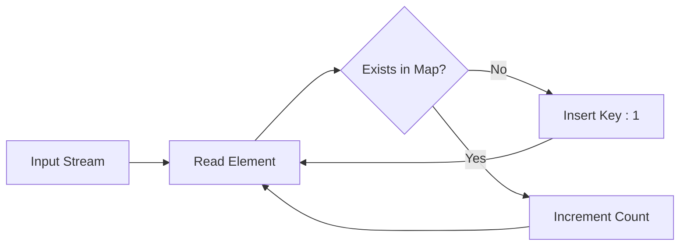

# 📊 Arrays and Strings

## 📚 Overview
**Arrays and Strings** are the most fundamental data structures in programming, appearing in most DSA problems.

## 🎯 **Common Problem Types**

### **1. Array Manipulation**
- **Searching** - Element search, binary search
- **Sorting** - Array sorting, finding order
- **Two Pointers** - Two pointers technique
- **Sliding Window** - Sliding window technique
- **Prefix Sum** - Prefix sum

### **2. String Problems**
- **Palindrome** - Symmetric strings
- **Substring** - Substrings
- **Anagram** - Character permutations
- **Pattern Matching** - Pattern search
- **String Manipulation** - String operations

## 📊 **Visual Guide**

### **Sliding Window Logic**
Used for finding subarrays (longest, shortest, specific sum).

```mermaid
graph TD
    A[Start: left=0, right=0] --> B[Add nums[right] to Window]
    B --> C{Window Invalid?}
    C -- Yes --> D[Remove nums[left]]
    D --> E[left++]
    E --> C
    C -- No --> F[Update Best Result]
    F --> G[right++]
    G --> B
```

### **Hash Map Frequency Counting**
Used for Anagrams, Top K Frequent, Duplicate checking.



## 🚀 **Key Algorithms**

### **1. Two Pointers**
```cpp
// Find pair of elements with sum equal to target
vector<int> twoSum(vector<int>& nums, int target) {
    int left = 0, right = nums.size() - 1;
    
    while (left < right) {
        int sum = nums[left] + nums[right];
        if (sum == target) {
            return {left, right};
        } else if (sum < target) {
            left++;
        } else {
            right--;
        }
    }
    return {};
}
```

### **2. Sliding Window**
```cpp
// Find shortest subarray with sum >= target
int minSubArrayLen(int target, vector<int>& nums) {
    int left = 0, right = 0;
    int windowSum = 0;
    int minLen = INT_MAX;
    
    while (right < nums.size()) {
        windowSum += nums[right];
        
        while (windowSum >= target) {
            minLen = min(minLen, right - left + 1);
            windowSum -= nums[left];
            left++;
        }
        
        right++;
    }
    
    return minLen == INT_MAX ? 0 : minLen;
}
```

### **3. Prefix Sum**
```cpp
// Calculate sum of subarray from i to j
class NumArray {
private:
    vector<int> prefixSum;
    
public:
    NumArray(vector<int>& nums) {
        prefixSum.resize(nums.size() + 1);
        prefixSum[0] = 0;
        
        for (int i = 0; i < nums.size(); i++) {
            prefixSum[i + 1] = prefixSum[i] + nums[i];
        }
    }
    
    int sumRange(int left, int right) {
        return prefixSum[right + 1] - prefixSum[left];
    }
};
```

## 🔍 **Problem Examples**

### **Easy Level**
- [1. Two Sum](https://leetcode.com/problems/two-sum/)
- [26. Remove Duplicates from Sorted Array](https://leetcode.com/problems/remove-duplicates-from-sorted-array/)
- [125. Valid Palindrome](https://leetcode.com/problems/valid-palindrome/)
- [283. Move Zeroes](https://leetcode.com/problems/move-zeroes/)

### **Medium Level**
- [15. 3Sum](https://leetcode.com/problems/3sum/)
- [209. Minimum Size Subarray Sum](https://leetcode.com/problems/minimum-size-subarray-sum/)
- [3. Longest Substring Without Repeating Characters](https://leetcode.com/problems/longest-substring-without-repeating-characters/)
- [424. Longest Repeating Character Replacement](https://leetcode.com/problems/longest-repeating-character-replacement/)

### **Hard Level**
- [42. Trapping Rain Water](https://leetcode.com/problems/trapping-rain-water/)
- [76. Minimum Window Substring](https://leetcode.com/problems/minimum-window-substring/)
- [239. Sliding Window Maximum](https://leetcode.com/problems/sliding-window-maximum/)

## 💡 **Key Insights**

### **1. Array Sorting**
```cpp
// Sorting is often necessary for Two Pointers
sort(nums.begin(), nums.end());

// Sorting with custom comparator
sort(nums.begin(), nums.end(), [](int a, int b) {
    return a > b;  // Sort in descending order
});
```

### **2. Hash Map Usage**
```cpp
// Count frequency of occurrence
unordered_map<int, int> freq;
for (int num : nums) {
    freq[num]++;
}

// Fast search
if (freq.count(target)) {
    // Target found
}
```

### **3. String Optimization**
```cpp
// Use vector instead of unordered_map for ASCII
vector<int> charCount(128, 0);

// String concatenation optimization
string result;
result.reserve(expectedLength);
```

## 🎯 **C++23 Modern Implementation**

### **Using std::ranges**
```cpp
// Modern array operations
auto findPair = [&](int target) -> std::optional<std::pair<int, int>> {
    auto left = nums.begin();
    auto right = std::ranges::prev(nums.end());
    
    while (left < right) {
        int sum = *left + *right;
        if (sum == target) {
            return std::make_pair(
                std::ranges::distance(nums.begin(), left),
                std::ranges::distance(nums.begin(), right)
            );
        } else if (sum < target) {
            left = std::ranges::next(left);
        } else {
            right = std::ranges::prev(right);
        }
    }
    return std::nullopt;
};
```

### **Using std::views**
```cpp
// Lazy evaluation for string operations
auto processString = [&](const std::string& s) {
    return s | std::views::filter([](char c) { return std::isalnum(c); })
             | std::views::transform([](char c) { return std::tolower(c); });
};
```

## 📊 **Complexity Analysis**

| Algorithm | Time | Space | Best For |
|-----------|------|-------|----------|
| Two Pointers | O(n) | O(1) | Sorted arrays |
| Sliding Window | O(n) | O(1) | Subarray problems |
| Prefix Sum | O(n) | O(n) | Range sum queries |
| Hash Map | O(n) | O(n) | Frequency counting |

## 🎓 **Practice Problems by Category**

### **Two Pointers**
1. [Two Sum II](https://leetcode.com/problems/two-sum-ii-input-array-is-sorted/)
2. [3Sum](https://leetcode.com/problems/3sum/)
3. [Container With Most Water](https://leetcode.com/problems/container-with-most-water/)

### **Sliding Window**
1. [Minimum Size Subarray Sum](https://leetcode.com/problems/minimum-size-subarray-sum/)
2. [Longest Substring Without Repeating Characters](https://leetcode.com/problems/longest-substring-without-repeating-characters/)
3. [Longest Repeating Character Replacement](https://leetcode.com/problems/longest-repeating-character-replacement/)

### **String Manipulation**
1. [Valid Palindrome](https://leetcode.com/problems/valid-palindrome/)
2. [Longest Palindromic Substring](https://leetcode.com/problems/longest-palindromic-substring/)
3. [Group Anagrams](https://leetcode.com/problems/group-anagrams/)

## 🔗 **Related Patterns**
- **Two Pointers** - Basic technique for arrays
- **Sliding Window** - Subarray problems
- **Hash Map** - Frequency counting and searching
- **Binary Search** - Search in sorted arrays

---

**Remember**: Arrays and Strings are the foundation of DSA. Practice a lot to master them! 🚀
