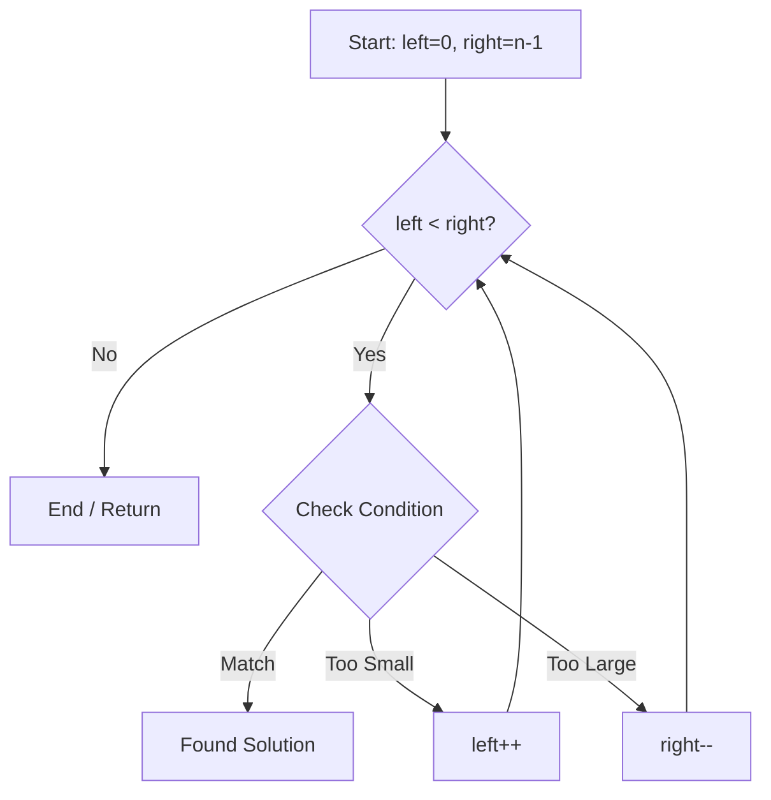
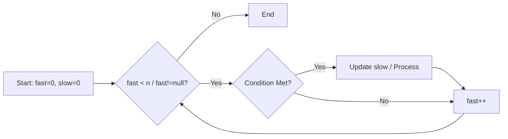

# 🎯 Two Pointers Technique

## 📚 Overview
The **Two Pointers** technique is a powerful algorithmic pattern that uses two pointers to solve problems efficiently.

## 🎯 **When to Use**
- **Array/List problems** - Find element pairs, sorting, traversal
- **String problems** - Palindrome, substring, character manipulation
- **Linked List problems** - Cycle detection, middle element, reverse
- **Sorted data** - Find pairs with sum equal to target

## 📊 **Visual Guide**

### **Converging Pointers (Opposite Direction)**
Used for Two Sum, Container With Most Water, Palindrome.



### **Fast & Slow Pointers (Same Direction)**
Used for Cycle Detection, Remove Duplicates, Middle of Linked List.



## 🚀 **Common Patterns**

### 1. **Opposite Directional** (Two pointers moving in opposite directions)

#### **Example 1: Two Sum in Sorted Array**
```cpp
// Find pair of elements with sum equal to target in sorted array
vector<int> twoSum(vector<int>& nums, int target) {
    int left = 0, right = nums.size() - 1;
    
    while (left < right) {
        int sum = nums[left] + nums[right];
        if (sum == target) {
            return {left, right};
        } else if (sum < target) {
            left++;
        } else {
            right--;
        }
    }
    return {};
}
```

#### **Example 2: Container With Most Water**
```cpp
// Find maximum area between two vertical lines
int maxArea(vector<int>& height) {
    int maxArea = 0;
    int left = 0, right = height.size() - 1;
    
    while (left < right) {
        int width = right - left;
        int minHeight = min(height[left], height[right]);
        int area = width * minHeight;
        maxArea = max(maxArea, area);
        
        // Key insight: Move the shorter pointer
        if (height[left] < height[right]) {
            left++;
        } else {
            right--;
        }
    }
    return maxArea;
}
```

**Time Complexity**: O(n)  
**Space Complexity**: O(1)

#### **Example 3: Trapping Rain Water**
```cpp
// Calculate trapped rainwater using two pointers
int trap(vector<int>& height) {
    if (height.empty()) return 0;
    
    int left = 0, right = height.size() - 1;
    int maxLeft = 0, maxRight = 0;
    int trappedWater = 0;
    
    while (left < right) {
        // Move pointer with smaller height
        if (height[left] < height[right]) {
            if (height[left] >= maxLeft) {
                maxLeft = height[left];  // Update max from left
            } else {
                trappedWater += maxLeft - height[left];  // Add trapped water
            }
            left++;
        } else {
            if (height[right] >= maxRight) {
                maxRight = height[right];  // Update max from right
            } else {
                trappedWater += maxRight - height[right];  // Add trapped water
            }
            right--;
        }
    }
    return trappedWater;
}
```

**Key Insight**: Water level at any position = min(maxLeft, maxRight)  
**Time Complexity**: O(n) - Single pass  
**Space Complexity**: O(1) - Constant space

### 2. **Same Directional** (Two pointers moving in same direction)
```cpp
// Remove duplicate elements from sorted array
int removeDuplicates(vector<int>& nums) {
    if (nums.empty()) return 0;
    
    int write = 1;  // Write pointer
    for (int read = 1; read < nums.size(); read++) {
        if (nums[read] != nums[read - 1]) {
            nums[write] = nums[read];
            write++;
        }
    }
    return write;
}
```

**Time Complexity**: O(n)  
**Space Complexity**: O(1)

### 3. **Fast and Slow** (Fast and slow pointers)
```cpp
// Detect cycle in linked list
bool hasCycle(ListNode* head) {
    if (!head || !head->next) return false;
    
    ListNode* slow = head;
    ListNode* fast = head->next;
    
    while (slow != fast) {
        if (!fast || !fast->next) return false;
        slow = slow->next;
        fast = fast->next->next;
    }
    return true;
}
```

**Time Complexity**: O(n)  
**Space Complexity**: O(1)

## 🔍 **Problem Examples**

### **Easy Level**
- [1. Two Sum](https://leetcode.com/problems/two-sum/) - Hash map approach
- [26. Remove Duplicates from Sorted Array](https://leetcode.com/problems/remove-duplicates-from-sorted-array/)
- [125. Valid Palindrome](https://leetcode.com/problems/valid-palindrome/)

### **Medium Level**
- [15. 3Sum](https://leetcode.com/problems/3sum/) - Two pointers + loop
- [167. Two Sum II - Input Array Is Sorted](https://leetcode.com/problems/two-sum-ii-input-array-is-sorted/)
- [283. Move Zeroes](https://leetcode.com/problems/move-zeroes/)

### **Hard Level**
- [42. Trapping Rain Water](https://leetcode.com/problems/trapping-rain-water/) - Water level calculation
- [76. Minimum Window Substring](https://leetcode.com/problems/minimum-window-substring/)

## 💡 **Key Insights**

### **1. Sort before using Two Pointers**
```cpp
// Always sort array before applying opposite directional
std::ranges::sort(nums);
```

### **2. Handle duplicates**
```cpp
// Skip duplicate elements to avoid duplicate results
while (left < right && nums[left] == nums[left - 1]) left++;
while (left < right && nums[right] == nums[right + 1]) right--;
```

### **3. Early Termination**
```cpp
// Stop early when possible
if (nums[left] + nums[right] > target) {
    // All remaining pairs will be > target
    break;
}
```

### **4. Greedy Choice in Container Problems**
```cpp
// In Container With Most Water, always move the shorter pointer
if (height[left] < height[right]) {
    left++;  // Moving taller pointer can only decrease area
} else {
    right--;
}
```

### **5. Water Level Calculation in Trapping Rain Water**
```cpp
// Key insight: Water level = min(maxLeft, maxRight)
// Move pointer with smaller height to ensure we know the water level
if (height[left] < height[right]) {
    // Process left side - we know maxRight >= height[right] >= height[left]
    if (height[left] >= maxLeft) {
        maxLeft = height[left];  // No water trapped
    } else {
        trappedWater += maxLeft - height[left];  // Water trapped
    }
    left++;
}
```

## 🎯 **C++23 Modern Implementation**

### **Using std::ranges**
```cpp
// Modern C++23 approach with std::ranges
auto findPair = [&](int target) -> std::optional<std::pair<int, int>> {
    auto left = nums.begin();
    auto right = std::ranges::prev(nums.end());
    
    while (left < right) {
        int sum = *left + *right;
        if (sum == target) {
            return std::make_pair(
                std::ranges::distance(nums.begin(), left),
                std::ranges::distance(nums.begin(), right)
            );
        } else if (sum < target) {
            left = std::ranges::next(left);
        } else {
            right = std::ranges::prev(right);
        }
    }
    return std::nullopt;
};
```

### **Using std::views**
```cpp
// Lazy evaluation with std::views
auto pairs = std::views::iota(0, static_cast<int>(nums.size()))
    | std::views::transform([&](int i) {
        return std::make_pair(i, nums[i]);
    })
    | std::views::filter([&](const auto& pair) {
        return pair.second > 0;  // Filter positive numbers
    });
```

## 📊 **Complexity Analysis**

| Pattern | Time | Space | Best For |
|---------|------|-------|----------|
| Opposite Directional | O(n) | O(1) | Sorted arrays, pairs |
| Same Directional | O(n) | O(1) | In-place operations |
| Fast and Slow | O(n) | O(1) | Cycle detection |

## 🎓 **Practice Problems**

### **Beginner**
1. [Valid Palindrome](https://leetcode.com/problems/valid-palindrome/)
2. [Remove Duplicates](https://leetcode.com/problems/remove-duplicates-from-sorted-array/)
3. [Move Zeroes](https://leetcode.com/problems/move-zeroes/)

### **Intermediate**
1. [Two Sum II](https://leetcode.com/problems/two-sum-ii-input-array-is-sorted/)
2. [3Sum](https://leetcode.com/problems/3sum/)
3. [Container With Most Water](https://leetcode.com/problems/container-with-most-water/)

### **Advanced**
1. [Trapping Rain Water](https://leetcode.com/problems/trapping-rain-water/)
2. [Minimum Window Substring](https://leetcode.com/problems/minimum-window-substring/)
3. [Longest Substring Without Repeating Characters](https://leetcode.com/problems/longest-substring-without-repeating-characters/)

## 🔗 **Related Patterns**
- **Sliding Window** - Extension of Two Pointers
- **Binary Search** - Search optimization
- **Greedy** - Optimal choice at each step

---

**Remember**: Two Pointers is a basic but powerful pattern. Practice a lot to master it! 🚀
